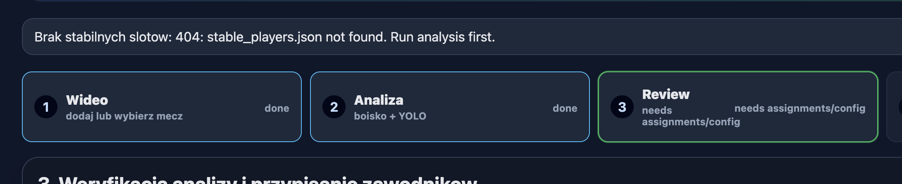
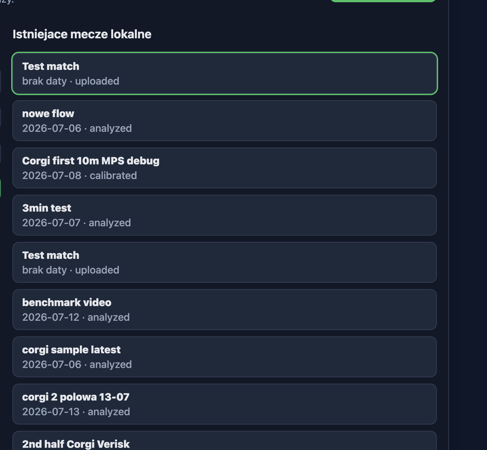

To jest plik do zadan, nie zawsze typowo koderskich, ktore potrzebujemy wykonac.

# Task 1

 - potrzebuje gdzies informacji 'jakie' wideo jest aktualnie w analizie/review; mozemy przy 1 kroku (po jego 'przejsciu') dodac dodatkowa informacje z nazwa meczu i pliku

# Task 2

 - potrzebuje zeby ta lista byla sortowana od gory od 'najnowszego' wideo + te karty meczowe powinny miec na sobie rowniez nazwe pliku wideo z ktorego jest analiza.