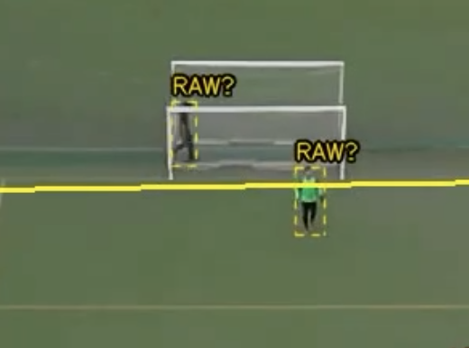

# 2424
widac rozjazd pitch config overlay vs realny pitch (duze odchylenie w prawo) 

ta sama klatka, prawie od poczatku meczu - bramkarz druzyny przeciwnej jest przypisany do teamu A, mimo ze to bramkarz teamu B (do teamu A aktualnie jest przypisanych 2 bramkarzy, A01 roraz A08?) - co znowu powoduje bledy, tak jak w przypadku part 1 (ten sam blad ze zle przypisanym bramkarzem byl w przypadku pierwszej visual tests)

# 3375
podwojny RAW? u gory boiska  - RAW zostal przypisany do jakiegos przechodnia za boiskiem (za koncowa linia góry boiska)

# 3421
dron wyraznie zaczal sie ruszac w poprzednich klatkach i zmienil swoja pozycje , pitch overlay teraz jest odchylony z lewo wzgledem realnego boiska

# 6850
pitch caly czas jest rozjechany wzgledem realnego

# 7105
zawodnik nie poprawnie przypisany do druzyny A - A10? to zawodnik druzyny B; jednoczesnie B03 to zawodnik druzyny A

# 7800 okolice

przez rozjechany overlay boiska zaczely w overlayu pitcha miescic sie pilki spoza boiska, zaczelo trackowac pilke ktora jest za boiskiem, zamiast tej ktora faktycznie graja druzyny - po prawej za linia widac ball detected, a realna pilka ktora toczy sie gra jest przy nogach bramkarza A01 ; konczy sie to dopiero w okolicach 8100 klatki; 

# 8800

tutaj problem w druga strone, pitch overlay w ogole sie nie aktualizuje wzgledem boiska przez to zaczelo sciagac zawodnikow, ktorzy stoja za linia boiska i aktualnie nie sa w grze

# 9070
overlay mocno odchylony w lewo 

ogolne uwagi:
- nie obejrzalem calego wideo, tylko pierwsze 6-7 minut ; nie opisywalem uwag az tak szczegolowo ale ogolnie wydaje sie niezle ; pilka w boisku jest niezle trackowana a gracze poprawnie przypisani (poza przypadkiem z bramkarzem)
- poczatkowy blad z bramkarzem na pewno zaburzyl przez pare minut detekcje graczy
- overlay pitcha sprawaia, ze niektore akcje ida poza overlayem pitch (mimo ze realnie sa jeszce w boisku) przez co gracze ani pilka nie jest trackowana w tym przypadku; ogolnie jest duzy problem z overlayu w tym wideo, jezdzi to lewo prawo (Faktycznie tez ujecie z drona nie ulatwia; dron sie dosc czesto rusza ale wydaje mi sie, ze to powinno byc zaimplementowane tak, zeby 'kontrowac' ruchy drona i overlay byl zawsze w poprawnym miejscu; a na pewno nie powinno byc az tak duzych odchylen);
